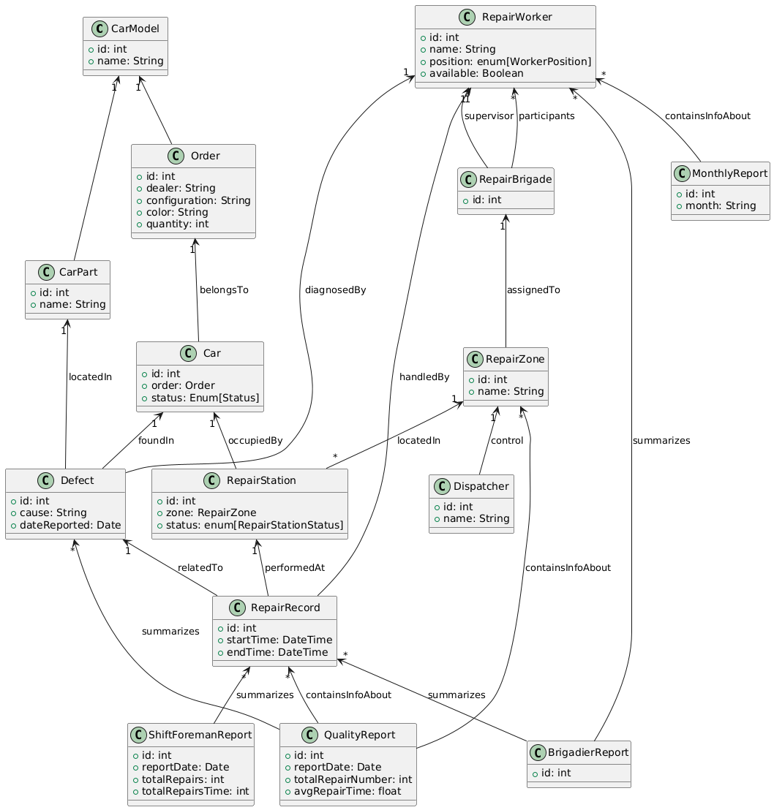

## Диаграмма классов

Комментарий: Считаем, что рабочий, установивший причину поломки, и ремонтирующий - не обязательно один и тот же человек. Человек, установивший причину известен в дефекте, а чинящий - в записи ремонта.

