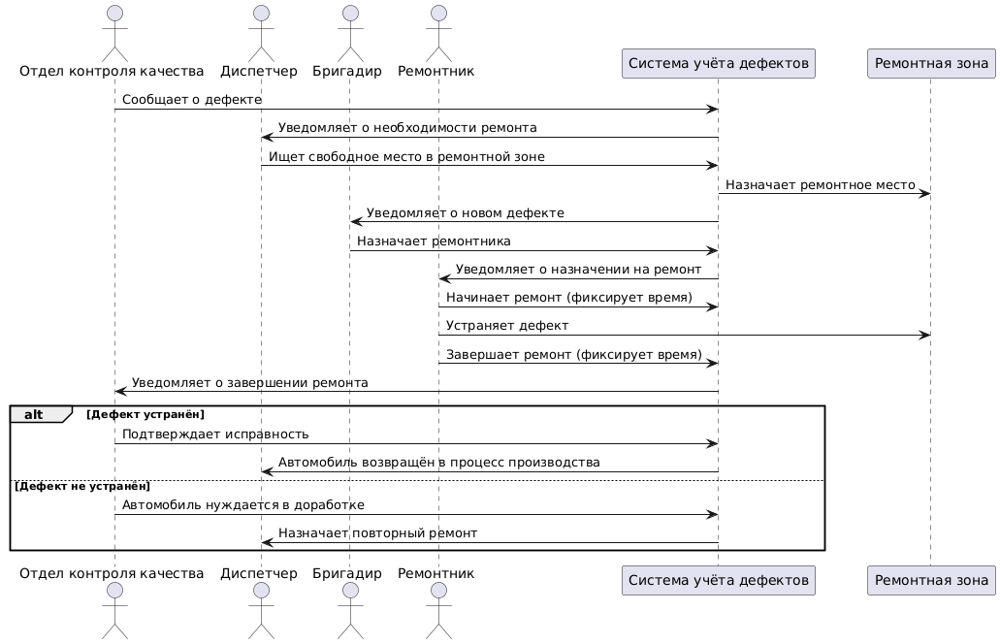
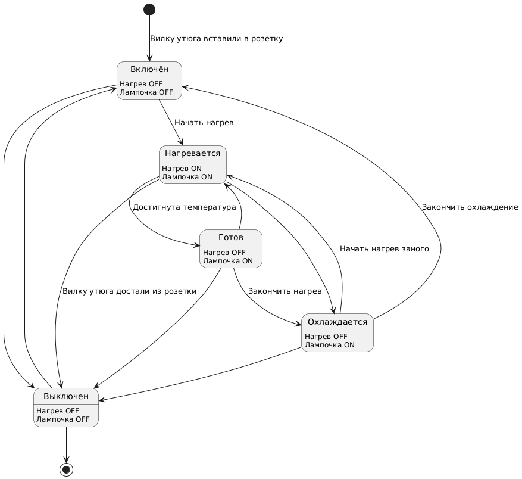
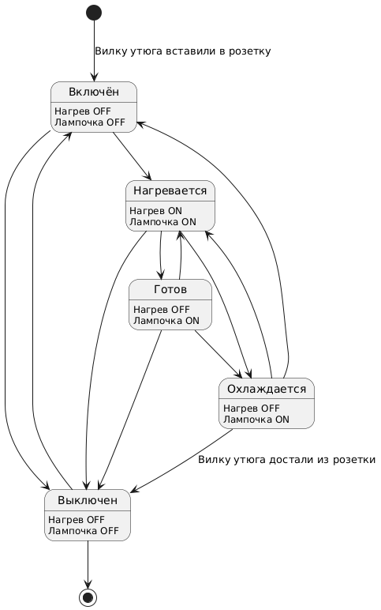
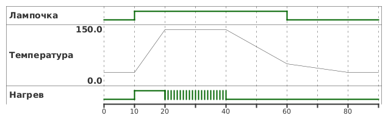

## Диаграмма последовательностей

## Диаграмма конечных автоматов

Комментарий: Для диаграм взяли утюг с лампочкой, которая горит если утюг ещё горячий. Вторая версия с меньшим описанием рёбер.

## Временная диаграмма

