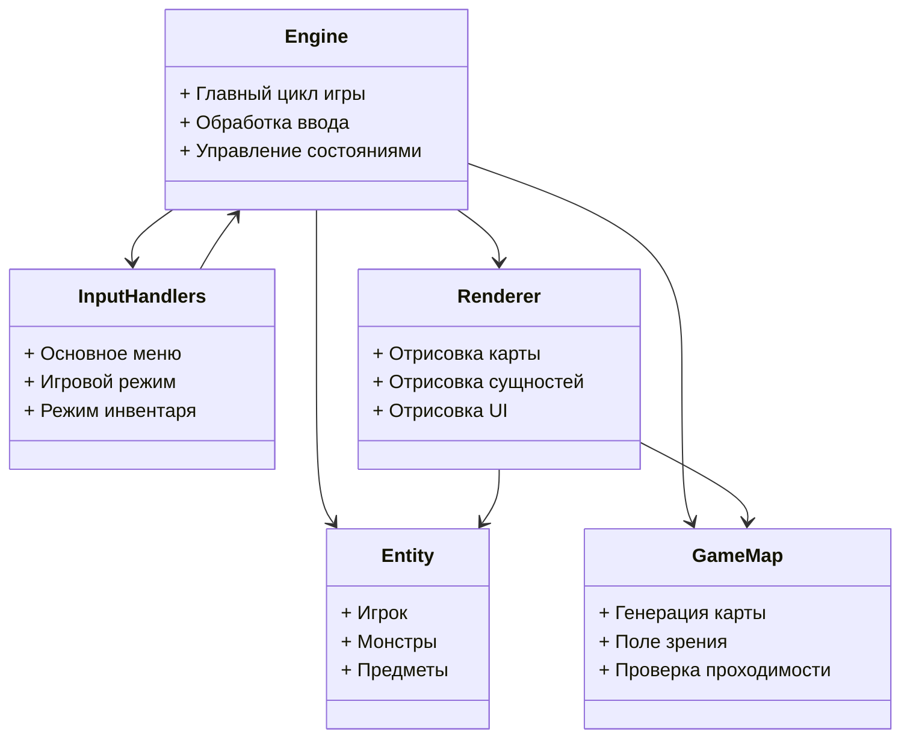
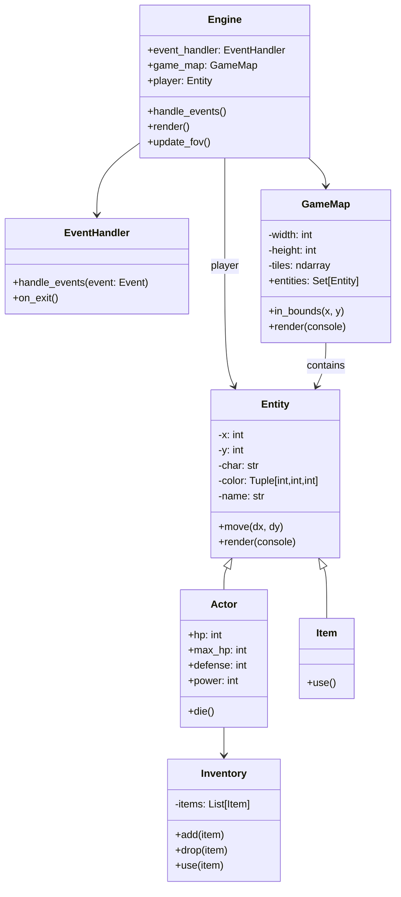
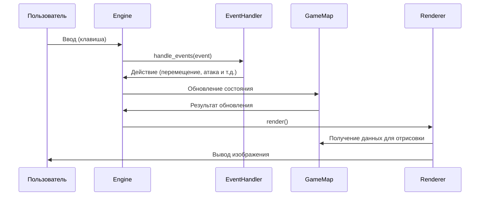
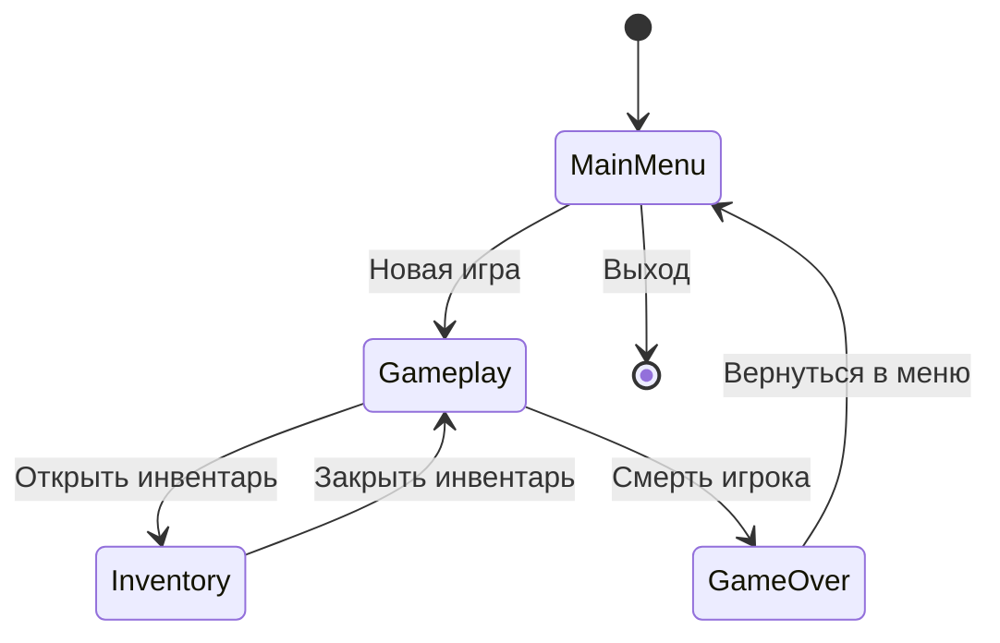

# Архитектурное описание Roguelike игры

## Общие сведения о системе

Игра представляет собой классический Roguelike с такими особенностями:
- Поклеточное перемещение персонажа
- Процедурная генерация подземелий
- Пошаговая система действий
- ФОВ (поле зрения)
- Простая система боя
- Инвентарь и сбор предметов

Игра реализована на Python с использованием библиотеки tcod (libtcod).

## Композиция (диаграмма компонентов)

Основные компоненты системы:
1. **Engine** - ядро игры, управляющее главным циклом и координацией между компонентами
2. **Entity** - представляет все объекты в игре (игрока, монстров, предметы)
3. **GameMap** - отвечает за генерацию и управление картой подземелья
4. **InputHandlers** - обработчики ввода для разных состояний игры
5. **Renderer** - система отрисовки игрового состояния

## Логическая структура (диаграмма классов)

Основные классы:
- **Engine**: Центральный класс, управляющий игровым циклом
- **EventHandler**: Базовый класс для обработки ввода
- **GameMap**: Представляет игровую карту и содержит все сущности
- **Entity**: Базовый класс для всех игровых объектов
- **Actor**: Наследник Entity, представляет живые существа с характеристиками
- **Item**: Наследник Entity, представляет предметы
- **Inventory**: Управление инвентарем актора

## Взаимодействия и состояния

### Диаграмма последовательности основного игрового цикла

### Диаграмма конечного автомата состояний игры

Состояния игры:
1. **MainMenu**: Главное меню игры (новая игра, загрузка, выход)
2. **Gameplay**: Основной игровой режим
3. **Inventory**: Режим управления инвентарем
4. **GameOver**: Состояние после смерти игрока

## Описание данных

Основные структуры данных в программе:

1. **Карта**:
   - Представлена двумерным массивом тайлов
   - Каждый тайл содержит:
     - Проходимость (можно ли ходить)
     - Прозрачность (влияет на поле зрения)
     - Видимость (видит ли игрок в данный момент)
     - Исследованность (был ли тайл виден ранее)

2. **Сущности (Entities)**:
   - Позиция (x, y) на карте
   - Символьное представление (ASCII-символ)
   - Цвет
   - Имя
   - Флаги (блокирует ли проход, подбираемость и т.д.)

3. **Акторы (Actors)**:
   - Наследуют от Entity
   - Добавляют:
     - Здоровье (HP)
     - Защита
     - Сила атаки
     - Инвентарь

4. **Предметы (Items)**:
   - Наследуют от Entity
   - Содержат эффекты при использовании

5. **Состояние игры**:
   - Текущий уровень подземелья
   - Состояние игрока
   - Список активных сущностей
   - Сообщения в логе

6. **Поле зрения (FOV)**:
   - Рассчитывается алгоритмом shadow casting
   - Хранит видимые клетки для игрока
   - Обновляется при перемещении игрока
